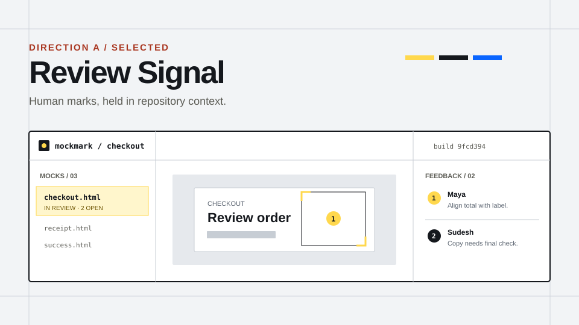
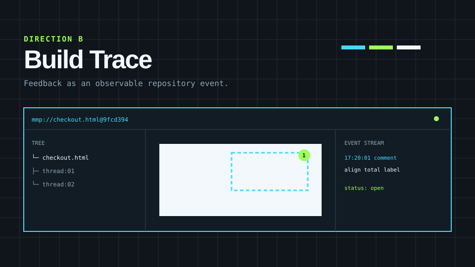
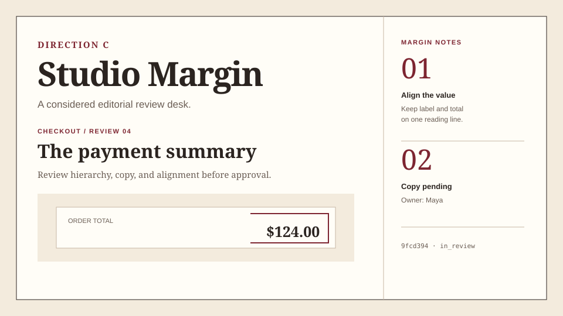

# Mockmark visual directions

Exploration date: **2026-08-22**
Evidence base: [brand research](brand-research.md)

These are different systems, not palette variants. Each proposes a distinct metaphor, type strategy, composition, interface behavior, and implementation cost.

## Evaluation criteria

- **Product fit:** expresses repo-scoped HTML-mock review and human→agent handoff.
- **Distinctiveness:** avoids category blue/purple SaaS convergence.
- **Usability:** supports dense review, dashboard, docs, and CLI content.
- **Accessibility:** preserves clear hierarchy, contrast, focus, and reduced motion.
- **Implementation cost:** can be executed incrementally without redesigning production UI now.
- **Longevity:** avoids a short-lived visual trend.
- **Recognizability:** remains identifiable without logo, gradient, or illustration.

## Direction A — Review Signal

### Concept

A live HTML mock treated as a review instrument: framed selections, numbered marks, ruled zones, build labels, and a conversation rail. Product state is visible immediately; repository context stays exact.

### Mood

Direct, precise, cool, candid, quietly technical.

### Palette

- Cool canvas `#F2F4F6`, white surface `#FFFFFF`, graphite `#15181D`.
- Signal yellow mark `#FFD84D`, with dark ochre `#6B5200` for accessible text.
- Cobalt `#0A65FF` reserved for focus/info—not primary identity.
- Semantic green/amber/red remain conventional and labeled.

### Typography

**Recursive** variable family across display, UI, and code:

- Proportional + Linear for display, UI, and body.
- Mono + Linear for paths, builds, shortcuts, tokens, and code.
- Same metrics across axes make the human→code shift coherent. Casual-axis styling is excluded because manufactured “human AI” expression is crowded territory.

### Composition

- 12-column grid; 8px rhythm; ruled work zones rather than card stacks.
- Persistent review rail in product examples.
- Open corner marks frame only selected or emphasized content.
- Left-aligned hierarchy; asymmetry comes from notes/rail, not random offsets.

### UI sample behavior

- Files form a compact tree; selected mock gets a signal-yellow rule, not a giant tinted card.
- Preview uses open-corner region marks and dark numbered pins.
- Feedback uses a ruled list with author, time, state, and message hierarchy.
- Lifecycle state and comment resolution remain separate controls.

### Strengths

- Directly derived from “mock,” “mark,” region selection, HTML paths, builds, and comments.
- Breaks from Claude/Cursor-adjacent warm-neutral styling and generic Inter/rounded-card styling.
- Strong without gradients, illustration, photography, or logo.
- Practical in browser UI, docs, CLI examples, social crops, and print.

### Risks

- Signal yellow can become construction-site decoration if used beyond active review state.
- Corner marks can become visual noise if applied to every container.
- Recursive axis usage needs fixed presets and font QA.

### Competitor similarity

Low. Signal yellow was not dominant in inspected feedback competitors; cool working surfaces avoid Claude/Cursor warmth. The review-corner + ruled-zone + proportional-to-mono system was not dominant. Numbered pins remain a necessary category convention.

## Direction B — Build Trace

### Concept

Feedback represented as an observable repository event: mock path, build hash, thread event, status transition. A visual bridge between browser review and terminal output.

### Mood

Fast, instrumented, technical, nocturnal, high-signal.

### Palette

- Near-black `#10151B`, slate `#121C24`, white `#F2F8FC`.
- Electric cyan `#46D9FF` for path/selection.
- Acid green `#9DFF5B` for live/resolved states.

### Typography

- Spline Sans or a compact grotesk for headings/UI.
- Azeret Mono or Recursive Mono for most metadata and navigation.
- Higher mono proportion than other directions.

### Composition

- Strict 40px technical grid; square panels; no shadows.
- Event-stream rail, path-first breadcrumbs, dashed selection bounds.
- Dense information blocks with syntax-like separators.

### UI sample behavior

- Review opens as a trace with tree, preview, and event stream.
- Status is a live signal; comments appear as timestamped events.
- Marketing uses flow diagrams and real path/build examples.

### Strengths

- Strong repository and agent-tool association.
- Excellent fit for CLI, docs, and developer onboarding.
- Highly recognizable through color and grid.

### Risks

- Overstates observability/automation features Mockmark does not claim.
- Dark-only identity is fatiguing in long visual review sessions.
- Cyan/lime terminal styling is a familiar developer-tool cliché.
- Nontechnical reviewers may read it as engineering-only.

### Competitor similarity

Medium. Not common in visual-feedback landing pages, but common across developer tools, observability products, and terminal brands. It could make Mockmark feel like a monitoring product.

## Direction C — Studio Margin

### Concept

A creative review desk: generous ivory pages, editorial headings, oxblood margin notes, and intentionally paced approval content.

### Mood

Considered, premium, literate, human, slow-confidence.

### Palette

- Ivory `#FFFDF7`, parchment `#F3EBDD`, dark brown `#2B2420`.
- Oxblood `#7D2531` for notes and approval marks.
- Muted sage for success and archival context.

### Typography

- Source Serif 4 or Fraunces for display/editorial moments.
- Public Sans for product UI.
- IBM Plex Mono for technical material.

### Composition

- Strong outer margins, editorial columns, note rail, hairline rules.
- Sparse surfaces; large typographic moments; minimal button chrome.
- Photography would show real desk/process details, never stock meetings.

### UI sample behavior

- Feedback sits in a true margin rail with large ordinal numbers.
- Preview dominates; admin controls recede.
- Marketing resembles a design publication more than SaaS documentation.

### Strengths

- Distinctive and calm; gives human feedback cultural weight.
- Excellent for launch, editorial content, and brand storytelling.
- Avoids AI and generic developer-tool styling.

### Risks

- Three font families increase load and implementation complexity.
- Serif display can imply agency/luxury rather than repo tooling.
- Large margins reduce dashboard density and mobile efficiency.
- Oxblood annotations can feel like correction/error language.

### Competitor similarity

Low in the feedback category. Some editorial SaaS brands use serif display, but the margin-note system is distinct. Functional similarity to proofing/editorial products remains.

## Decision matrix

Score: 1 weak, 3 adequate, 5 excellent. Implementation cost is scored inversely: 5 = easiest/lowest cost.

| Criterion | Weight | Review Signal | Build Trace | Studio Margin |
|---|---:|---:|---:|---:|
| Product fit | 2 | 5 | 4 | 4 |
| Distinctiveness | 2 | 5 | 4 | 5 |
| Usability | 2 | 5 | 4 | 4 |
| Accessibility | 2 | 5 | 4 | 4 |
| Implementation cost | 1 | 4 | 3 | 3 |
| Longevity | 1 | 5 | 3 | 5 |
| Recognizability | 2 | 5 | 4 | 5 |
| **Weighted total / 60** |  | **59** | **46** | **52** |

## Selected direction: Review Signal

Review Signal wins because every signature device maps to existing behavior:

- Corner marks = point/region annotation.
- Numbered marks = conversation anchors.
- Ruled review rail = feedback alongside the mock.
- Proportional→mono type = human feedback becoming repository-readable context.
- White/cool-gray/graphite surfaces = working UI, not simulated paper.
- Signal yellow = explicit review attention without Claude orange or AI purple.

It replaces the current warm-neutral/coral cluster, generic typography, excessive rounding, and card dependence. The deeper market correction is documented in [Avoiding the generic AI-product aesthetic](ai-slop-design-research.md).

### Superseded decision

The first research pass selected **Proof Sheet**. That decision is invalidated: it focused on feedback-tool competitors and gradient-heavy AI clichés, but missed Claude/Cursor's warm-neutral editorial cluster. Review behavior survives; paper styling does not.

## Why the others were rejected

### Build Trace

Rejected as canonical identity because it overweights developer/agent context and makes the product appear to perform automated tracing or code changes. It is useful as a **technical campaign mode** for CLI documentation, but not the brand default.

### Studio Margin

Rejected as canonical identity because it introduces three-font complexity and sacrifices product density. Its editorial pacing may inform long-form launch material, but serif luxury cues would obscure Mockmark's lightweight repo utility.

## Human approval still required

- Trademark/legal review of the proof-mark symbol and `mockmark` wordmark before registration or broad launch.
- Confirmation that Recursive's Latin Basic subset covers initial launch languages; add official subsets before wider localization.
- Product decision on whether dark theme ships alongside first branded production UI. Guidelines define it, but no production UI change is included here.
